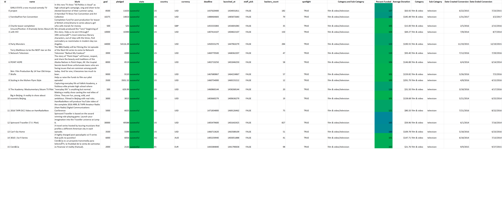
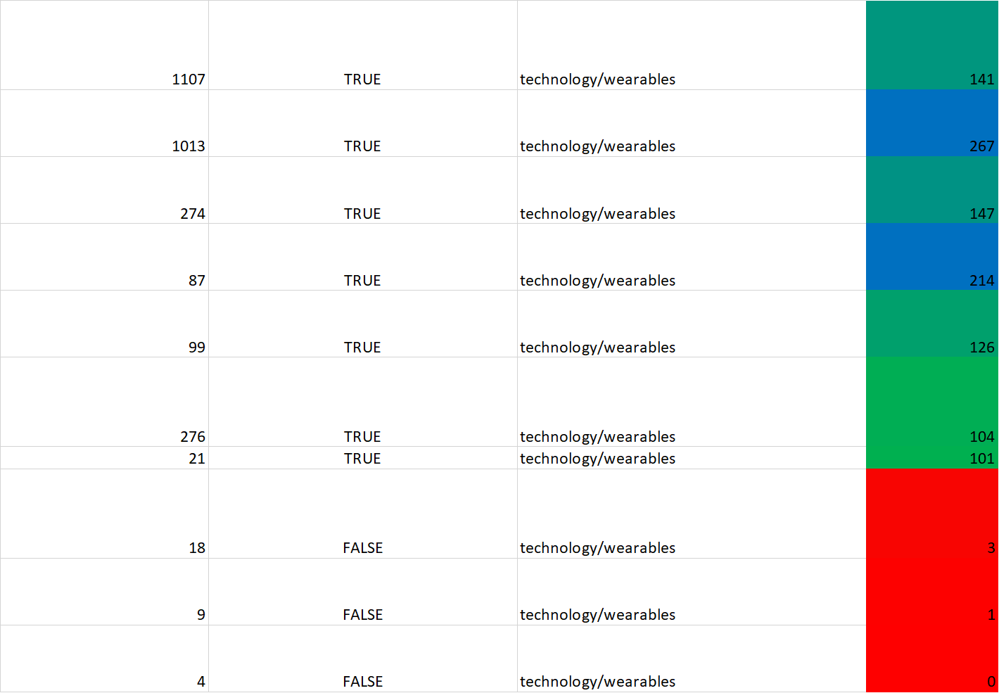
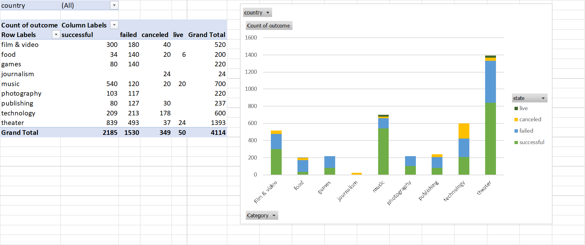
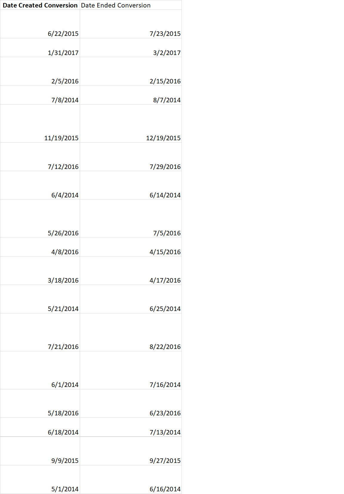
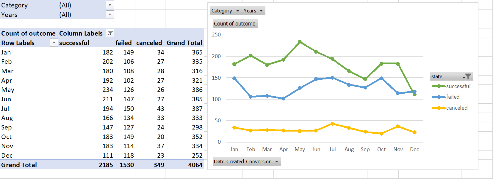
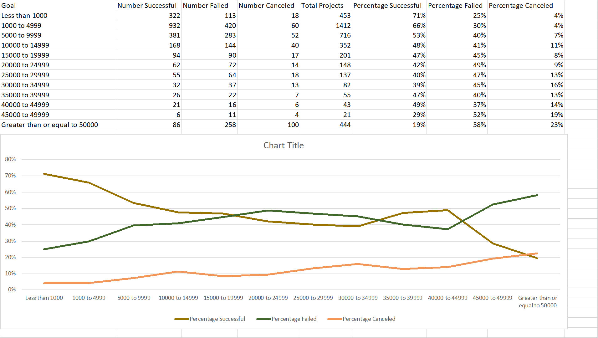
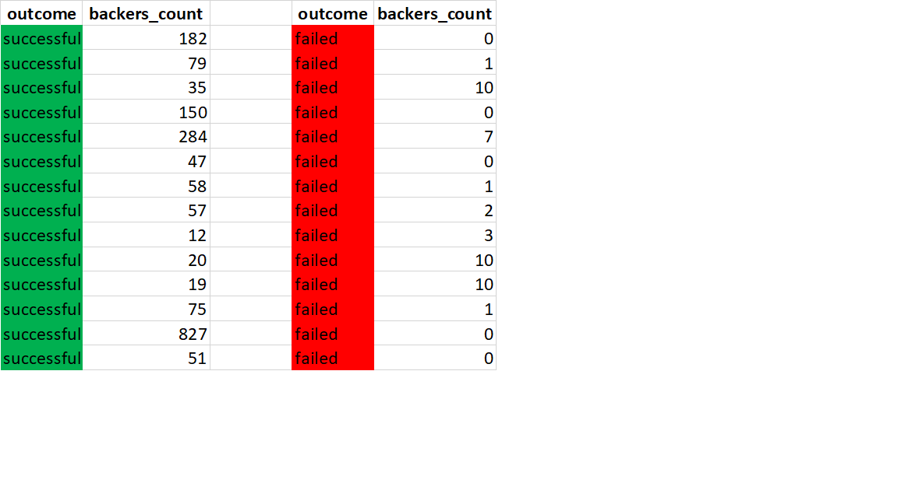

# excel-challenge
Kickstarter Analysis in Excel

Using the Excel table provided, modified and analyzed the data of 4,000 past Kickstarter projects

* Used conditional formatting to fill each cell in the `state` column with a different color, depending on whether the associated campaign was successful, failed, or canceled, or is currently live.

  * Created a new column O called `Percent Funded` that uses a formula to uncover how much money a campaign made to reach its initial goal.

 

* Used conditional formatting to fill each cell in the `Percent Funded` column using a three-color scale. The scale should start at 0 and be a dark shade of red, transitioning to green at 100, and blue at 200.

  * Created a new column P called `Average Donation` that uses a formula to uncover how much each backer for the project paid on average.

  * Created two new columns, one called `Category` at Q and another called `Sub-Category` at R, which use formulas to split the `Category and Sub-Category` column into two parts.

  

  * Created a new sheet with a pivot table that will analyze your initial worksheet to count how many campaigns were successful, failed, canceled, or are currently live per **category**.

  * Created a stacked column pivot chart that can be filtered by country based on the table you have created.

  

  * Created a new sheet with a pivot table that will analyze your initial sheet to count how many campaigns were successful, failed, or canceled, or are currently live per **sub-category**.

  * Created a stacked column pivot chart that can be filtered by country and parent-category based on the table you have created.

* The dates stored within the `deadline` and `launched_at` columns use Unix timestamps. Fortunately for us, [there is a formula](https://www.extendoffice.com/documents/excel/2473-excel-timestamp-to-date.html) that can be used to converted these timestamps to a normal date.

  * Created a new column named `Date Created Conversion` that will use [this formula](https://www.extendoffice.com/documents/excel/2473-excel-timestamp-to-date.html) to convert the data contained within `launched_at` into Excel's date format.

  * Created a new column named `Date Ended Conversion` that will use [this formula](https://www.extendoffice.com/documents/excel/2473-excel-timestamp-to-date.html) to convert the data contained within `deadline` into Excel's date format.

  

  * Created a new sheet with a pivot table with a column of `state`, rows of `Date Created Conversion`, values based on the count of `state`, and filters based on `parent category` and `Years`.

  * Now create a pivot chart line graph that visualizes this new table.

* Created a report in Microsoft Word and answer the following questions.

1. Three conclusions we can draw about Kickstarter campaigns
2. Some limitations of this dataset
3. Other possible tables and/or graphs that we could create

## Bonus

* Used the `COUNTIFS()` formula, count how many successful, failed, and canceled projects were created with goals within the ranges listed above. Populate the `Number Successful`, `Number Failed`, and `Number Canceled` columns with this data.

* Added up each of the values in the `Number Successful`, `Number Failed`, and `Number Canceled` columns to populate the `Total Projects` column. Then, using a mathematical formula, find the percentage of projects that were successful, failed, or canceled per goal range.

* Created a line chart that graphs the relationship between a goal's amount and its chances at success, failure, or cancellation.

## Bonus Statistical Analysis

* Created a new worksheet in your workbook, and create a column each for the number of backers of successful campaigns and unsuccessful campaigns.

  

* Used Excel to evaluate the following for successful campaigns, and then for unsuccessful campaigns:

  * The mean number of backers.

  * The median number of backers.

  * The minimum number of backers.

  * The maximum number of backers.

  * The variance of the number of backers.

  * The standard deviation of the number of backers.

* Using the data and determined whether the mean or the median summarizes the data more meaningfully.

* Using the data and determined if there is more variability with successful or unsuccessful campaigns. 

